# Multipass 架构设计文档

## 目录

- [整体架构](#整体架构)
- [客户端-守护进程架构](#客户端-守护进程架构)
- [gRPC 通信层](#grpc-通信层)
- [守护进程内部架构](#守护进程内部架构)
- [虚拟化后端架构](#虚拟化后端架构)
- [平台抽象层](#平台抽象层)
- [镜像管理架构](#镜像管理架构)
- [挂载系统架构](#挂载系统架构)
- [配置系统架构](#配置系统架构)
- [安全架构](#安全架构)
- [关键数据流](#关键数据流)

---

## 整体架构

Multipass 采用**客户端-守护进程（Client-Daemon）**架构，通过 gRPC 进行进程间通信。

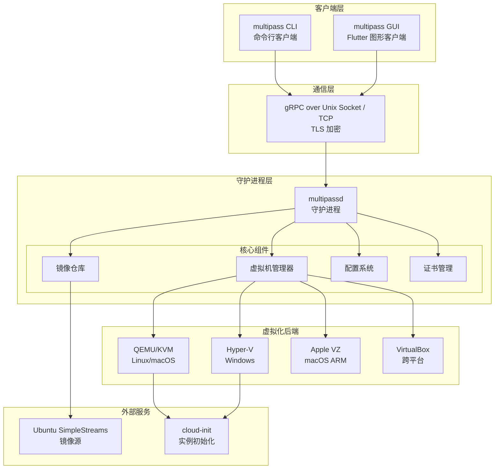

---

## 客户端-守护进程架构

### 通信方式

| 平台 | 通信地址 | 说明 |
|------|----------|------|
| Linux | `unix:/run/multipass_socket` | Unix Domain Socket |
| macOS | `unix:/var/run/multipass_socket` | Unix Domain Socket |
| Windows | `localhost:50051` | TCP 本地回环 |

### 认证机制

客户端与守护进程之间使用 **TLS 双向认证**：
1. 守护进程生成自签名根证书（`multipass_root_cert.pem`）
2. 客户端首次连接时需要通过认证（passphrase 或证书）
3. 认证成功后，客户端证书被存储在 `authenticated-certs/` 目录

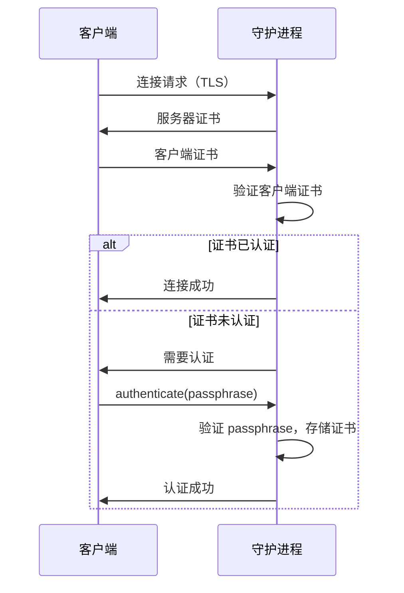

---

## gRPC 通信层

### RPC 服务定义

Multipass 使用 Protocol Buffers 定义 RPC 接口（`src/rpc/multipass.proto`），所有 RPC 均为**双向流式**（`stream`），支持实时进度反馈。

**完整 RPC 接口列表：**

| RPC 方法 | 功能 | 请求类型 | 响应类型 |
|----------|------|----------|----------|
| `launch` | 启动/创建实例 | `LaunchRequest` | `LaunchReply` |
| `create` | 创建实例（同 launch） | `LaunchRequest` | `LaunchReply` |
| `start` | 启动已停止的实例 | `StartRequest` | `StartReply` |
| `stop` | 停止实例 | `StopRequest` | `StopReply` |
| `suspend` | 挂起实例 | `SuspendRequest` | `SuspendReply` |
| `restart` | 重启实例 | `RestartRequest` | `RestartReply` |
| `delet` | 删除实例 | `DeleteRequest` | `DeleteReply` |
| `purge` | 彻底清除已删除实例 | `PurgeRequest` | `PurgeReply` |
| `recover` | 恢复已删除实例 | `RecoverRequest` | `RecoverReply` |
| `find` | 查找可用镜像 | `FindRequest` | `FindReply` |
| `list` | 列出实例/快照 | `ListRequest` | `ListReply` |
| `info` | 获取实例详情 | `InfoRequest` | `InfoReply` |
| `networks` | 列出网络接口 | `NetworksRequest` | `NetworksReply` |
| `mount` | 挂载目录 | `MountRequest` | `MountReply` |
| `umount` | 卸载目录 | `UmountRequest` | `UmountReply` |
| `ssh_info` | 获取 SSH 连接信息 | `SSHInfoRequest` | `SSHInfoReply` |
| `snapshot` | 创建快照 | `SnapshotRequest` | `SnapshotReply` |
| `restore` | 恢复快照 | `RestoreRequest` | `RestoreReply` |
| `clone` | 克隆实例 | `CloneRequest` | `CloneReply` |
| `get` | 获取配置项 | `GetRequest` | `GetReply` |
| `set` | 设置配置项 | `SetRequest` | `SetReply` |
| `keys` | 列出配置键 | `KeysRequest` | `KeysReply` |
| `authenticate` | 认证客户端 | `AuthenticateRequest` | `AuthenticateReply` |
| `version` | 获取版本信息 | `VersionRequest` | `VersionReply` |
| `daemon_info` | 获取守护进程信息 | `DaemonInfoRequest` | `DaemonInfoReply` |
| `wait_ready` | 等待守护进程就绪 | `WaitReadyRequest` | `WaitReadyReply` |
| `ping` | 心跳检测 | `PingRequest` | `PingReply` |

---

## 守护进程内部架构

### 核心类结构

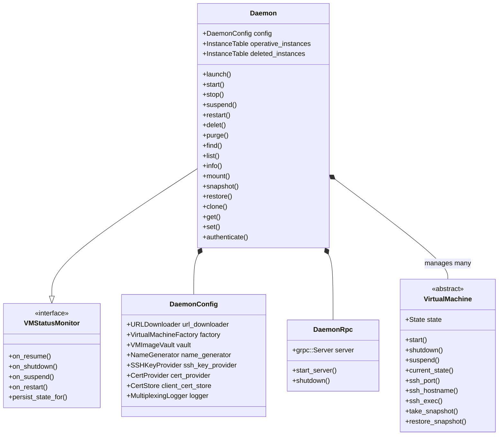

### DaemonConfig 依赖关系

`DaemonConfig` 是守护进程的核心配置容器，通过依赖注入方式组装所有核心组件：

```mermaid
graph LR
    DC[DaemonConfig] --> URL[URLDownloader<br/>镜像下载]
    DC --> FACTORY[VirtualMachineFactory<br/>VM 工厂]
    DC --> VAULT[VMImageVault<br/>镜像仓库]
    DC --> HOSTS[VMImageHost[]<br/>镜像源列表]
    DC --> NAMEGEN[NameGenerator<br/>名称生成器]
    DC --> SSHKEY[SSHKeyProvider<br/>SSH 密钥]
    DC --> CERT[CertProvider<br/>TLS 证书]
    DC --> CERTSTORE[CertStore<br/>客户端证书存储]
    DC --> LOGGER[MultiplexingLogger<br/>多路日志]
    DC --> PROXY[QNetworkProxy<br/>网络代理]
```

---

## 虚拟化后端架构

### 后端继承层次

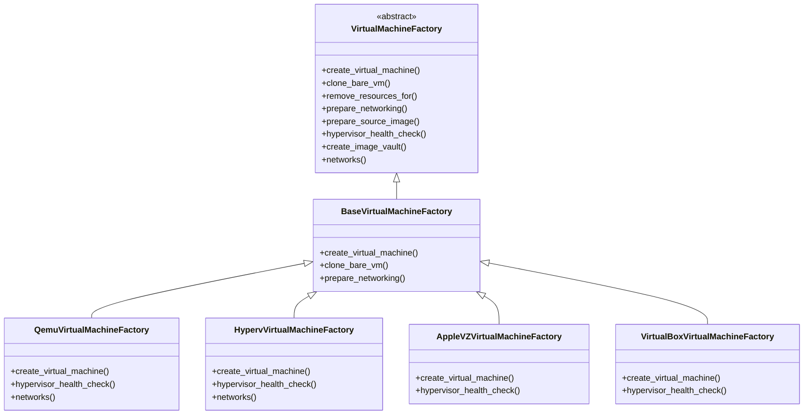

### 虚拟机实例继承层次

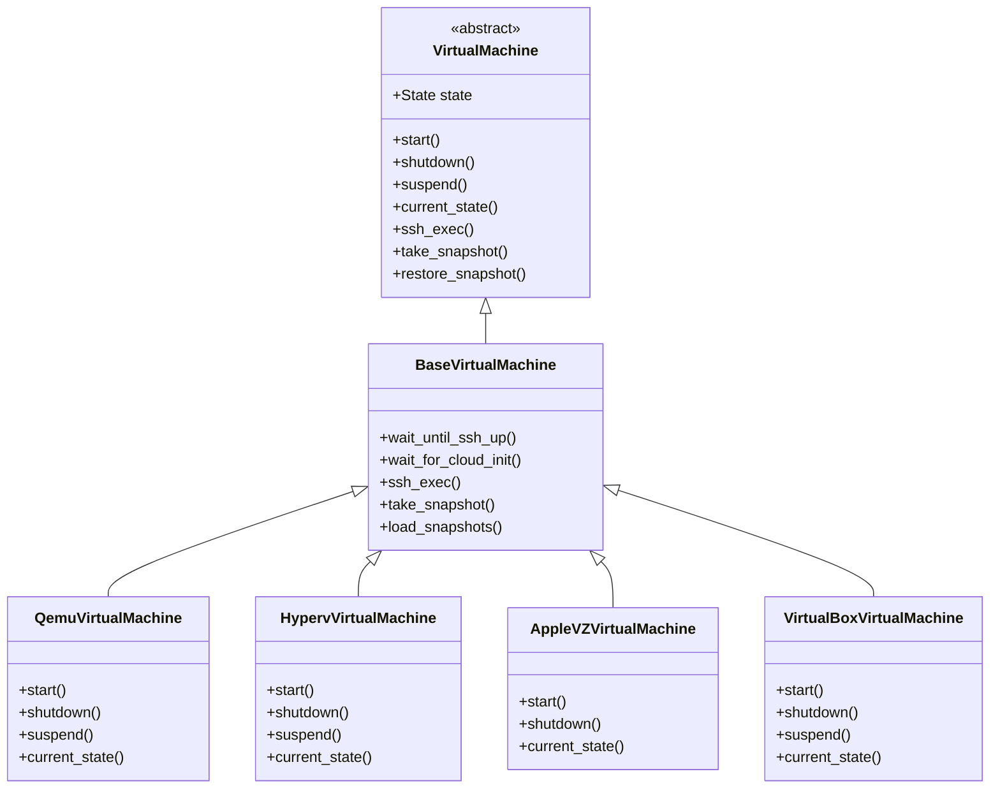

---

## 平台抽象层

`Platform` 类（单例）提供平台相关功能的统一接口，各平台有独立实现：

| 平台文件 | 说明 |
|----------|------|
| `platform_linux.cpp` | Linux 平台实现 |
| `platform_osx.cpp` | macOS 平台实现 |
| `platform_win.cpp` | Windows 平台实现 |
| `platform_unix.cpp` | Unix 通用实现（Linux/macOS 共享） |

**Platform 主要职责：**
- 获取网络接口信息
- 文件权限管理（`chown`、`chmod`）
- 别名脚本管理
- 默认虚拟化后端选择
- 日志系统创建
- 更新提示创建
- 进程创建（SSHFS 服务器等）

---

## 镜像管理架构

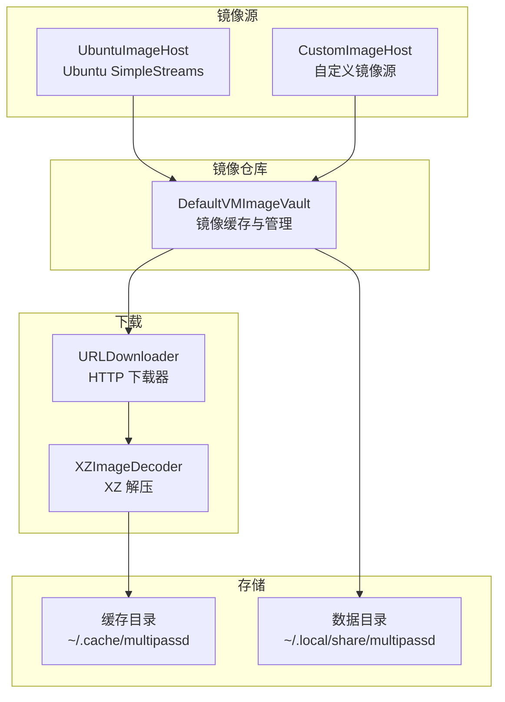

### SimpleStreams 协议

Multipass 使用 Ubuntu 的 SimpleStreams 协议获取镜像元数据：
1. 下载 `streams/v1/index.json` 获取流索引
2. 根据索引下载对应的 manifest 文件
3. 从 manifest 中解析镜像信息（版本、哈希、下载 URL）
4. 按需下载镜像文件（`.img` 或 `.xz` 格式）

---

## 挂载系统架构

Multipass 支持两种挂载方式：

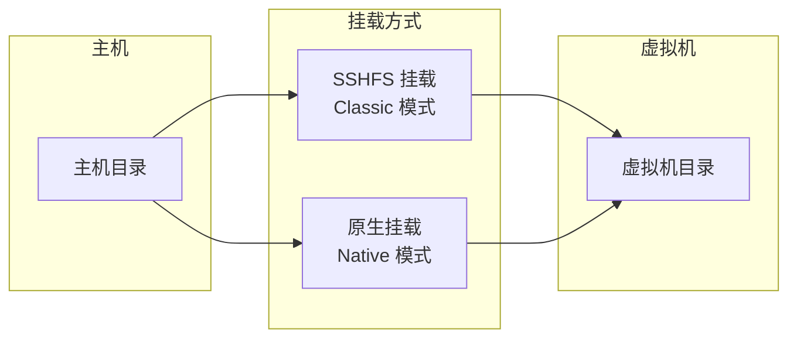

### SSHFS 挂载流程

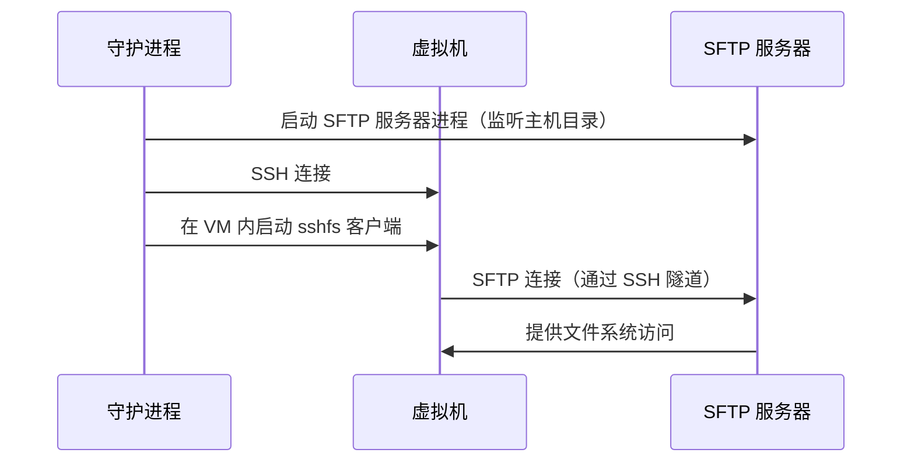

---

## 配置系统架构

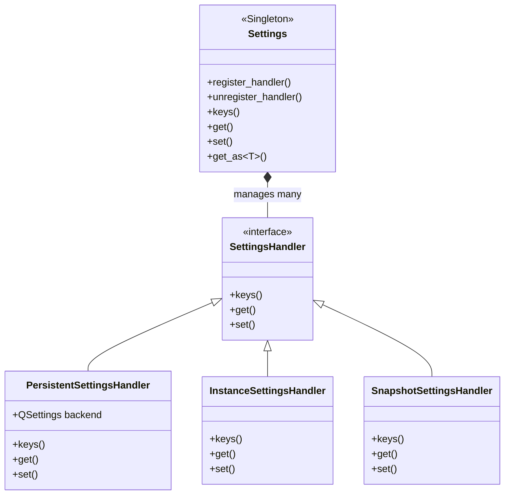

### 配置键（Settings Keys）

| 配置键 | 说明 | 默认值 |
|--------|------|--------|
| `client.primary-name` | 主实例名称 | `primary` |
| `local.driver` | 虚拟化后端 | 平台默认 |
| `local.passphrase` | 认证密码短语 | 无 |
| `local.bridged-network` | 桥接网络名称 | 无 |
| `local.privileged-mounts` | 是否允许特权挂载 | 平台默认 |
| `client.apps.windows-terminal.profiles` | Windows Terminal 配置 | 无 |
| `local.image.mirror` | 镜像镜像源 | 无 |

---

## 安全架构

### TLS 证书体系

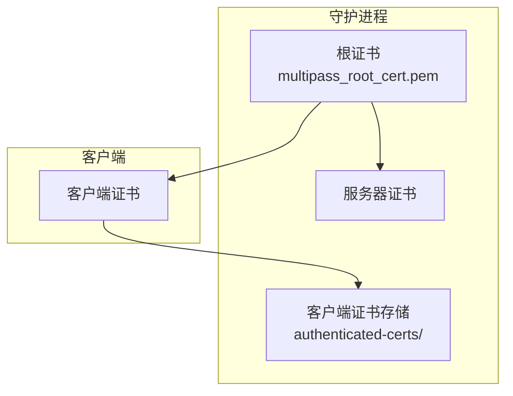

### 认证流程

1. **首次连接**：客户端生成自签名证书，尝试连接守护进程
2. **未认证状态**：守护进程拒绝未认证客户端的大多数操作
3. **认证**：用户通过 `multipass authenticate <passphrase>` 认证
4. **证书存储**：认证成功后，客户端证书被存储，后续连接自动认证

### 文件权限

- 守护进程以 root 权限运行（Linux/macOS）
- 客户端以普通用户权限运行
- Socket 文件权限受限，防止未授权访问

---

## 关键数据流

### 实例启动流程（`multipass launch`）

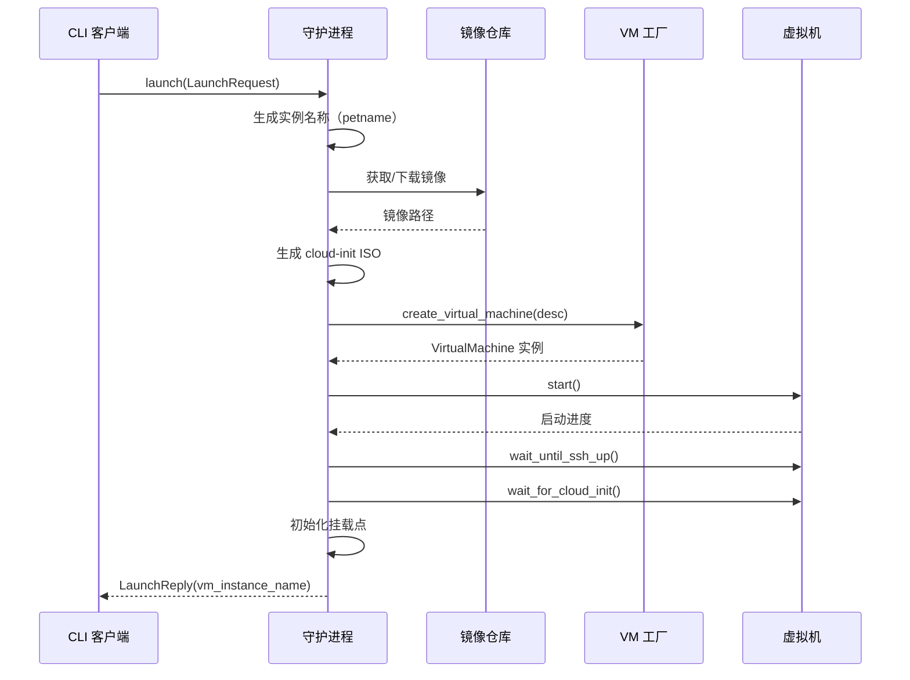

### 快照创建流程（`multipass snapshot`）

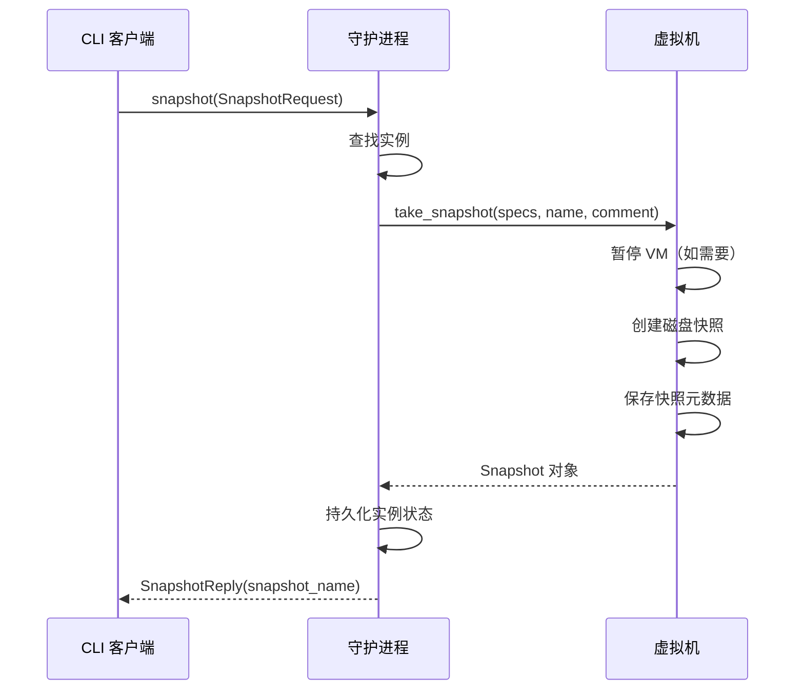

---

*文档生成时间：2026-04-05 | 版本：v1.0*
